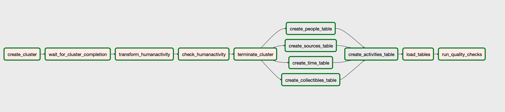

# HumanActivity
Data Engineering Nanodegree capstone project

- The project combines two important technology trends - data engineering in healthcare and IoT. Used data is part of research which help to assess health.
- THe first phase of this project cleans up the data and creates a model to be loaded and analyzed later

# Data Sources
- Human Activity data [source](https://www.kaggle.com/sasanj/human-activity-smart-devices)

# Data Lake to Star Schema design
- Data has been prepared for simple COPY operation in redshift/BigQuery/any other data warehousing solution using pyspark
- Raw files are stored on s3 bucket, as well as final table feeds
- Star Schema has been chosen due to it's high query performance and ease of understanding

# Data Warehouse design
## Dimensions:
- People: table describing the tested person
- Sources: source of collectibles (smartphone/smartwatch/glasses/report)
- Collectibles: type of reads
- Time
## Facts:
- Activities: a value for given person, in given time, from given source, for a given collectible

# AWS Infrastructure
- The AWS infrastructure is set up according to this [tutorial](https://aws.amazon.com/blogs/big-data/build-a-concurrent-data-orchestration-pipeline-using-amazon-emr-and-apache-livy/)
- Upload the CloudFormation script to create the resources, such as EC2 instance, RDS database for Airflow, security groups, S3 bucket
- Then connect to the EC2 instance:
```
sudo su
cd ~/airflow
source ~/.bash_profile
airflow scheduler
airflow webserver
```
# DAG



